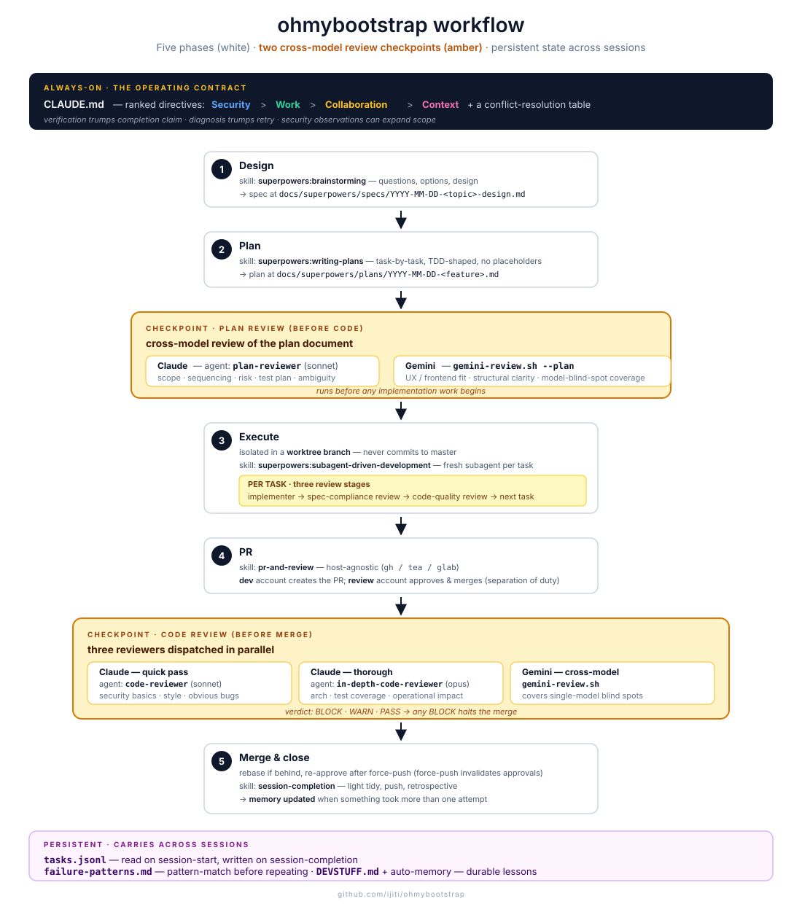

# ohmybootstrap

An opinionated Claude Code setup kit distilled from a mature private monorepo's agent workflow. Point a Claude Code session at this repo and ask it to adapt your project.

## How it works



Three stages: ① you clone the kit; ② an `APPLY.md`-driven agent installs files into your project root and `~/.claude/`, with approval at every write; ③ a Claude session in your project auto-loads the directives + memory and invokes the kit's skills/agents on demand.

## Usage

1. Open a Claude Code session in your project.
2. Clone this repo somewhere the session can reach: `git clone https://github.com/ijiti/ohmybootstrap ~/ohmybootstrap`.
3. Tell the session: **"Read `~/ohmybootstrap/APPLY.md` and adapt this project to match. Ask me before each change."**
4. Approve each step as the agent walks through it.

## What gets installed

- **`CLAUDE.md`** at your project root — the operating contract. Structured as ranked directive groups (Security / Work Discipline / Collaboration / Context & Memory) with a conflict-resolution table. Filled in to match your project's stack, conventions, and deployment story.
- **7 agents** at `~/.claude/agents/` — `developer`, `frontend-craftsman`, `devops`, `security-auditor`, `code-reviewer`, `in-depth-code-reviewer`, `plan-reviewer`.
- **4 skills** at `.claude/skills/` (or `~/.claude/skills/` on request) — `session-start`, `session-completion`, `pr-and-review`, `tidy`.
- **`failure-patterns.md`** at your project root — catalog of hard-won lessons to pattern-match against.
- **Scaffolds** — empty `tasks.jsonl`, optional nested CLAUDE.md files, auto-memory directory.

## What's *not* here

No hostnames, no domain names, no fleet-specific tooling, no proprietary tool paths. Patterns are generic. The specifics of your project are filled in by the APPLY agent based on what it finds in your repo.

## Recommended dependency

The kit's CLAUDE.md template and skill flow reference the [superpowers](https://github.com/anthropics/claude-plugins-official) plugin for the heavy process skills (brainstorming → writing-plans → executing-plans, TDD, debugging, verification, worktrees, parallel-agent dispatch). References degrade gracefully if superpowers is not installed — but the kit is more useful with it.

## Layout

```
APPLY.md                          ← agent entry point
README.md                         ← this file
claude/
  CLAUDE.md.template              ← the directive skeleton
  MEMORY.md.template              ← auto-memory index scaffold
  agents/                         ← 7 agent definitions
  skills/                         ← 4 skill definitions
  failure-patterns.md             ← lessons catalog
reference/                        ← conceptual docs the APPLY agent links into your CLAUDE.md
  directive-groups.md
  memory-system.md
  subagent-dispatch.md
  worktrees-and-parallelism.md
  verification-discipline.md
  command-tiers.md
  brainstorm-plan-execute.md
examples/
  CLAUDE.md                       ← filled-in example for a hypothetical Python web app
  tasks.jsonl                     ← empty scaffold
```

## Customize

After the APPLY agent's initial pass, everything it wrote is yours to edit, extend, or remove. Nothing in this kit is load-bearing — it's a starting point.

## Origin

Distilled from a private infrastructure-as-code monorepo's agent workflow, stripped of project-specific details. The patterns have been refined across many sessions of multi-agent coordination, CI/CD, infra ops, and cross-repo development.
